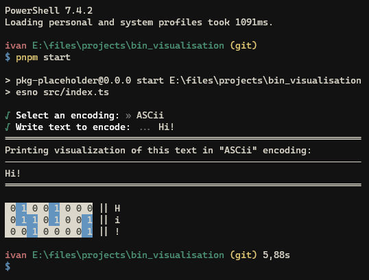

# encoding-visualization

[![License][license-src]][license-href]

Visualization of the encodings in Terminal.

At this moment supports ASCii, UTF-8 and KOI8-R. If you need additional encodings, you can add they to `./src/encodings.ts` file.

## License

[MIT](./LICENSE) License © 2024-PRESENT [SeryiBaran](https://github.com/SeriBaran)

<!-- Badges -->

[license-src]: https://img.shields.io/github/license/SeryiBaran/encoding-visualization.svg?style=flat&colorA=080f12&colorB=1fa669
[license-href]: https://github.com/SeryiBaran/encoding-visualization/blob/main/LICENSE
